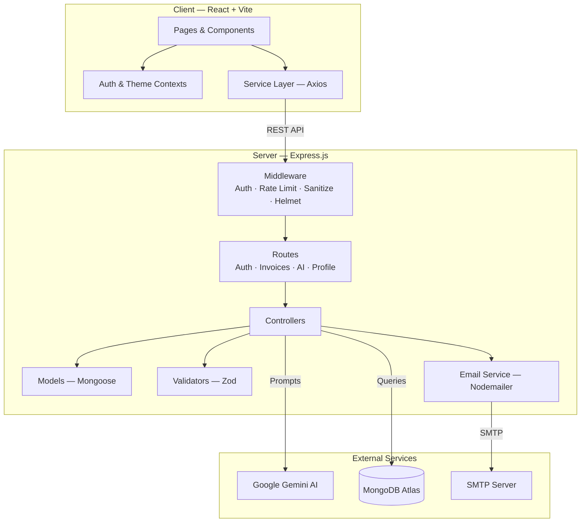

# Invio — AI-Powered Invoice Generator

A full-stack MERN application for creating, managing, and sending professional invoices with integrated AI capabilities powered by Google Gemini.


---

## Features

### Core
- **Invoice CRUD** — Create, read, update, and delete invoices with line items, tax, and discounts
- **Auto-generated invoice numbers** — Sequential `INV-YYYY-NNNN` format with race-condition retry logic
- **Status management** — Draft → Sent → Paid / Overdue lifecycle
- **PDF export** — Download any invoice as a styled PDF
- **Print-optimized CSS** — Clean print layout with hidden UI chrome

### AI-Powered (Google Gemini)
- **Natural language invoice creation** — Describe an invoice in plain English, AI generates structured data
- **Payment reminders** — Generate professional, friendly, or urgent reminder emails
- **Business insights** — Revenue trends, payment health scores, client patterns, actionable recommendations

### Authentication & Security
- **JWT auth** — Access tokens (15 min) + refresh tokens (7 days, httpOnly cookie)
- **Silent refresh** — Axios interceptor auto-refreshes expired tokens
- **Rate limiting** — Global (100/15 min), auth (15/15 min), AI (20/15 min)
- **Input sanitization** — MongoDB injection prevention via `express-mongo-sanitize`
- **Regex DoS protection** — User search input is escaped before regex compilation
- **Helmet** — Secure HTTP headers

### Email Integration
- **Send invoices** — Email styled HTML invoices directly to clients
- **Send reminders** — Email AI-generated payment reminders
- **Preview mode** — When SMTP is unconfigured, emails are logged to console for development

### User Experience
- **Dark mode** — System-preference-aware with manual toggle, persisted to localStorage
- **Responsive design** — Mobile-first with collapsible sidebar drawer
- **Skeleton loaders** — Shimmer placeholders during data fetches
- **Empty states** — Helpful messaging with CTAs when no data exists
- **Animated transitions** — Page and card animations via Framer Motion
- **Dashboard** — Revenue charts, status breakdown, recent invoices, top clients, AI insights widget

---

## Architecture



### Request Flow

```
Browser → Vite Dev Server (:5173)
  → Proxy /api → Express (:5000)
    → Helmet → CORS → Rate Limiter → JSON Parser → Mongo Sanitize
      → Route → Auth Middleware → Zod Validation → Controller → Mongoose → MongoDB
```

---

## Tech Stack

| Layer      | Technology                                                        |
| ---------- | ----------------------------------------------------------------- |
| Frontend   | React 18, Vite 5, Tailwind CSS 3, Framer Motion, Recharts        |
| Backend    | Node.js, Express 4, Mongoose 8, Zod, Helmet, express-rate-limit  |
| Database   | MongoDB Atlas                                                     |
| AI         | Google Gemini 2.0 Flash (`@google/generative-ai`)                |
| Auth       | JWT (access + refresh tokens), bcryptjs                           |
| Email      | Nodemailer                                                        |
| PDF        | html2pdf.js (client-side)                                         |
| Icons      | Lucide React                                                      |

---

## Project Structure

```
Invio/
├── client/                   # React frontend
│   ├── src/
│   │   ├── components/
│   │   │   ├── common/       # LoadingSpinner, SkeletonLoader, ProtectedRoute
│   │   │   └── layout/       # Layout, Header (theme toggle), Sidebar
│   │   ├── context/          # AuthContext, ThemeContext
│   │   ├── pages/            # Dashboard, Invoices, InvoiceForm, InvoiceDetail,
│   │   │                     #   Profile, AICreator, Login, Signup
│   │   ├── services/         # Axios API wrappers (auth, invoice, ai, profile)
│   │   ├── utils/            # pdfExport, formatters
│   │   ├── App.jsx           # Routes + providers
│   │   └── index.css         # Tailwind layers + dark mode component classes
│   ├── tailwind.config.js    # darkMode: 'class', custom primary palette
│   └── vite.config.js        # Proxy /api → :5000
│
├── server/                   # Express backend
│   ├── config/               # Centralized config from env vars
│   ├── controllers/          # auth, invoice, ai, profile controllers
│   ├── middleware/            # auth (JWT verify), errorHandler
│   ├── models/               # User, Invoice (with auto-number generation)
│   ├── routes/               # RESTful route definitions
│   ├── services/             # emailService (Nodemailer + HTML templates)
│   ├── utils/                # AppError class
│   ├── validators/           # Zod schemas (auth, invoice, profile)
│   └── server.js             # App entry — middleware chain + route mounting
│
├── .env.example              # Environment variable template
└── README.md
```

---

## Getting Started

### Prerequisites

- **Node.js** ≥ 18
- **MongoDB Atlas** account (or local MongoDB)
- **Google Gemini API key** — [Get one free](https://aistudio.google.com/app/apikey)

### 1. Clone & Install

```bash
git clone https://github.com/mokshlab/Invio.git
cd Invio

# Server
cd server
npm install

# Client
cd ../client
npm install
```

### 2. Configure Environment

```bash
# Copy the template
cp .env.example server/.env

# Edit server/.env with your values:
#   MONGO_URI        — your MongoDB connection string
#   JWT_ACCESS_SECRET  — random secret (e.g. openssl rand -hex 32)
#   JWT_REFRESH_SECRET — random secret
#   GEMINI_API_KEY     — from Google AI Studio
#   SMTP_*           — optional, for email sending
```

### 3. Run Development Servers

```bash
# Terminal 1 — Server
cd server
npm run dev          # nodemon → http://localhost:5000

# Terminal 2 — Client
cd client
npm run dev          # vite → http://localhost:5173
```

### 4. Build for Production

```bash
cd client
npm run build        # outputs to client/dist/
```

---

## API Endpoints

### Auth (`/api/auth`)
| Method | Path         | Description              | Rate Limit   |
| ------ | ------------ | ------------------------ | ------------ |
| POST   | `/signup`    | Register new user        | 15 / 15 min  |
| POST   | `/login`     | Login, returns tokens    | 15 / 15 min  |
| POST   | `/refresh`   | Refresh access token     | 15 / 15 min  |
| POST   | `/logout`    | Clears refresh cookie    | 15 / 15 min  |

### Invoices (`/api/invoices`) — 🔒 Authenticated
| Method | Path              | Description                        |
| ------ | ----------------- | ---------------------------------- |
| GET    | `/`               | List invoices (filter, search, paginate) |
| GET    | `/stats`          | Dashboard statistics               |
| GET    | `/email-status`   | Check if SMTP is configured        |
| GET    | `/:id`            | Get invoice by ID                  |
| POST   | `/`               | Create invoice (auto-generates number) |
| PUT    | `/:id`            | Update invoice                     |
| PATCH  | `/:id/status`     | Change status (sent/paid/overdue)  |
| DELETE | `/:id`            | Delete invoice                     |
| POST   | `/:id/send`       | Send invoice via email             |

### AI (`/api/ai`) — 🔒 Authenticated
| Method | Path              | Description                    | Rate Limit   |
| ------ | ----------------- | ------------------------------ | ------------ |
| POST   | `/generate`       | Generate invoice from text     | 20 / 15 min  |
| POST   | `/reminder`       | Generate payment reminder      | 20 / 15 min  |
| POST   | `/insights`       | Generate business insights     | 20 / 15 min  |
| POST   | `/send-reminder`  | Send reminder email            | 20 / 15 min  |

### Profile (`/api/profile`) — 🔒 Authenticated
| Method | Path         | Description              |
| ------ | ------------ | ------------------------ |
| GET    | `/`          | Get profile              |
| PUT    | `/`          | Update profile           |
| PUT    | `/password`  | Change password          |

---

## Environment Variables

| Variable             | Required | Default                         | Description                               |
| -------------------- | -------- | ------------------------------- | ----------------------------------------- |
| `PORT`               | No       | `5000`                          | Server port                               |
| `NODE_ENV`           | No       | `development`                   | Environment                               |
| `MONGO_URI`          | **Yes**  | —                               | MongoDB connection string                 |
| `JWT_ACCESS_SECRET`  | **Yes**  | —                               | Secret for signing access tokens          |
| `JWT_REFRESH_SECRET` | **Yes**  | —                               | Secret for signing refresh tokens         |
| `CLIENT_URL`         | No       | `http://localhost:5173`         | CORS origin                               |
| `GEMINI_API_KEY`     | **Yes**  | —                               | Google Gemini API key                     |
| `SMTP_HOST`          | No       | —                               | SMTP server host                          |
| `SMTP_PORT`          | No       | `587`                           | SMTP server port                          |
| `SMTP_USER`          | No       | —                               | SMTP username                             |
| `SMTP_PASS`          | No       | —                               | SMTP password / app password              |
| `SMTP_FROM`          | No       | `"Invio <noreply@invio.app>"`   | Sender address                            |

---

## Key Design Decisions

1. **Invoice number retry loop** — `Invoice.createWithRetry()` handles race conditions where two concurrent requests might generate the same sequential number. Catches MongoDB E11000 duplicate key errors and retries up to 3 times.

2. **Tiered rate limiting** — Global API limit protects infrastructure. Stricter limits on auth endpoints prevent brute force. AI endpoints have their own pool to prevent abuse of expensive Gemini API calls.

3. **Email preview mode** — When SMTP credentials are not configured, the email service logs to console instead of throwing errors. This allows full development without an email provider.

4. **Silent token refresh** — Axios response interceptor detects 401 errors, queues concurrent requests, refreshes the access token via the httpOnly refresh cookie, then replays all queued requests transparently.

5. **Dark mode via Tailwind `class` strategy** — Allows manual toggle independent of OS preference while respecting system preference on first visit. Theme state persisted to localStorage.

---

## License

MIT
